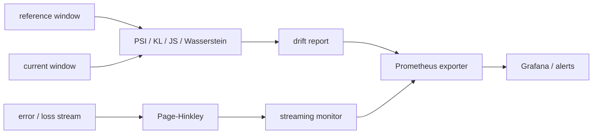
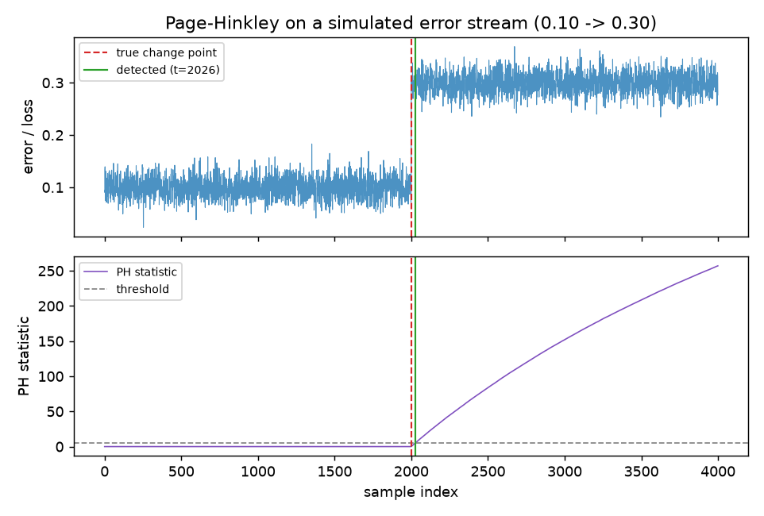
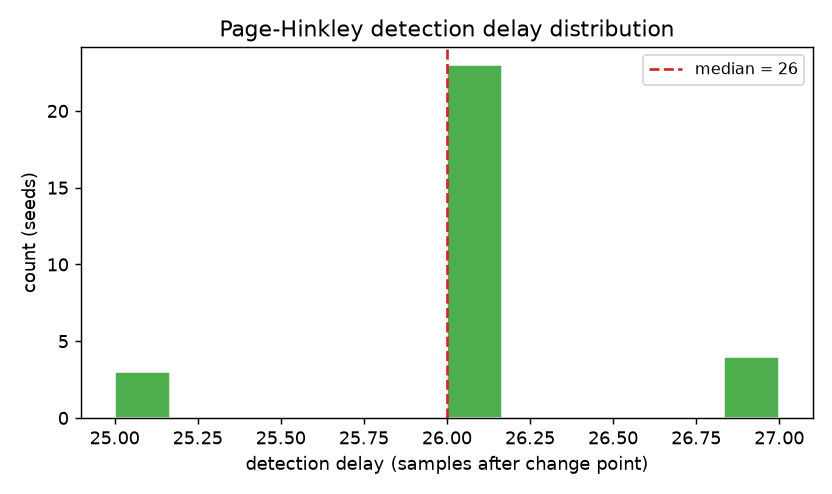
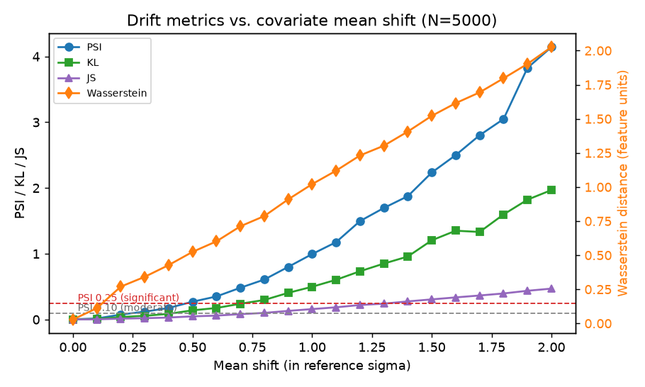

# mlops-drift-detector

Statistical drift monitoring for production ML — detect **data drift** and **concept drift** with well-understood statistics, and export them to Prometheus so silent model decay becomes an alertable signal instead of a surprise.

[](https://github.com/ejazfahil/mlops-drift-detector/actions/workflows/ci.yml)


## Headline result

From `python benchmarks/run_benchmark.py` (seed 42, CPU only — no GPU or API keys). Raw artifacts in [`results/`](results/).

- **Concept drift:** Page-Hinkley detects an abrupt error-rate increase (0.10 → 0.30) in a **median of 26 samples** across 30 seeds — **100% detection rate**, **0 false alarms** on matched stationary streams.
- **Feature drift:** PSI crosses its conventional *moderate* band (0.10) at a **0.3σ** covariate mean shift and *significant* (0.25) at **0.5σ**; Wasserstein distance tracks the shift ≈1:1, an independent correctness check.

## Approach

Three concerns, one exporter:

| Concern | Question | Method |
|---|---|---|
| Feature drift | Did the input distribution move? | PSI (+ KL, JS, Wasserstein) per numeric feature |
| Concept drift | Did the error stream change regime? | Page-Hinkley sequential change-point test |
| Streaming | Detect online in O(1) memory | Bounded-window monitor, auto-reset + callback |
| Export | Make it observable | Prometheus text-exposition gauges → Grafana / alerts |



## Reproduce it

Environment: Python 3.11–3.14 (results captured on **3.14.5**, macOS/Linux, CPU only). Full run ≈ 10 s.

```bash
git clone https://github.com/ejazfahil/mlops-drift-detector
cd mlops-drift-detector
python -m venv venv && source venv/bin/activate
pip install -r requirements.txt

make bench     # regenerate every table + plot in results/
make test      # 12 tests
```

The benchmark is fully seeded and `results/config.json` records the seed and exact library versions, so a fresh run reproduces the committed numbers. **No external dataset** — every scenario is synthetic and defined in code, so nothing needs downloading or redistribution rights.

## Results

### Concept drift — Page-Hinkley (30 seeds)

| Metric | Value |
|---|---|
| Detection rate | **100%** (30/30) |
| Median detection delay | **26 samples** |
| Mean ± std delay | 26.03 ± 0.48 (range 25–27) |
| False-alarm rate (stationary stream) | **0.0** |

An error stream of 4000 samples steps from `N(0.10, 0.02)` to `N(0.30, 0.02)` at t=2000. Page-Hinkley (δ=0.01, λ=5, warm-up 30) runs online; detection delay = first alarm index − 2000, averaged over 30 seeds. A matched stationary stream (no change point) measures false alarms. Full data: [`results/concept_drift_detection.json`](results/concept_drift_detection.json).




### Feature drift — distribution-distance sensitivity (N=5000)

| Mean shift (σ) | PSI | KL | Wasserstein | Status |
|---:|---:|---:|---:|---|
| 0.0 | 0.004 | 0.002 | 0.029 | stable |
| 0.2 | 0.076 | 0.038 | 0.270 | stable |
| 0.3 | 0.119 | 0.057 | 0.341 | moderate_shift |
| 0.5 | 0.271 | 0.140 | 0.524 | significant_shift |
| 1.0 | 0.996 | 0.498 | 1.021 | significant_shift |
| 2.0 | 4.143 | 1.969 | 2.026 | significant_shift |

Reference `N(0,1)`, current `N(shift, 1)`. PSI/KL/JS on 10 bins; Wasserstein on raw samples. Variance-shift rows and the full grid are in [`results/feature_drift_sensitivity.csv`](results/feature_drift_sensitivity.csv).



## Use it

```python
import pandas as pd
from src.detectors.feature_drift import FeatureDriftDetector
from src.detectors.streaming_detector import StreamingDriftMonitor
from src.exporters.prometheus import PrometheusExporter

# batch feature drift → Prometheus metrics
det = FeatureDriftDetector(reference_df, threshold=0.25)
report = det.detect(current_df)     # {"features": {...}, "drifted": [...], "overall": bool}
print(PrometheusExporter().export(report))

# online concept drift on an error stream
mon = StreamingDriftMonitor(ph_threshold=5.0, delta=0.01,
                            on_drift=lambda e: print("DRIFT", e))
for err in error_stream:
    mon.update(err)
```

## Tech stack

Python · NumPy · pandas · SciPy (Wasserstein) · matplotlib (plots) · pytest · Prometheus text exposition · Docker · GitHub Actions CI. The streaming path uses the standard library only (`collections.deque`, `dataclasses`).

## Limitations

- Synthetic Gaussian scenarios validate the **algorithms**, not any specific deployed model. Real feature streams are messier (mixed types, seasonality, missingness).
- PSI and KL are binning-sensitive; metrics here are per-feature and 1-D — no multivariate interaction is modelled.
- Page-Hinkley detects sustained **increases** in a scalar signal; δ (slack) and λ (threshold) are scaled to the signal magnitude and must be re-tuned per stream.
- The 26-sample delay is specific to this shift size and noise level: larger shifts detect faster, smaller ones slower. It is not a universal constant.

## Next steps

- Categorical-feature drift (chi-square / JS on category frequencies).
- Multivariate drift (classifier two-sample test / MMD) for feature interactions.
- Wire the exporter into the streaming monitor behind a live `/metrics` endpoint with a Grafana dashboard JSON (deployment sketch in [`docs/DEPLOYMENT.md`](docs/DEPLOYMENT.md)).
- Drift attribution: rank features by their contribution to the overall signal.

---

MIT licensed. Built by Fahil Ejaz.
